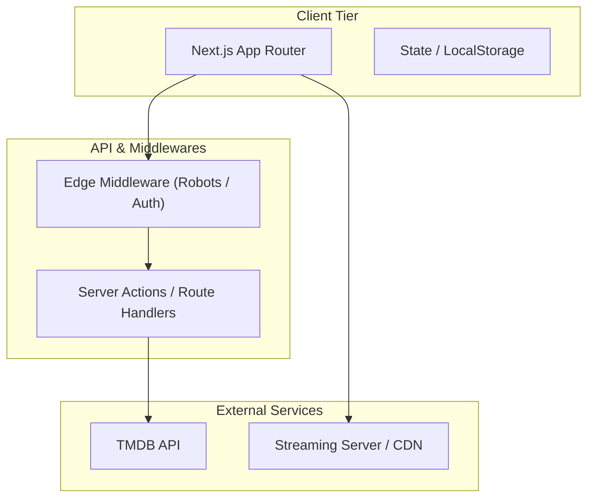
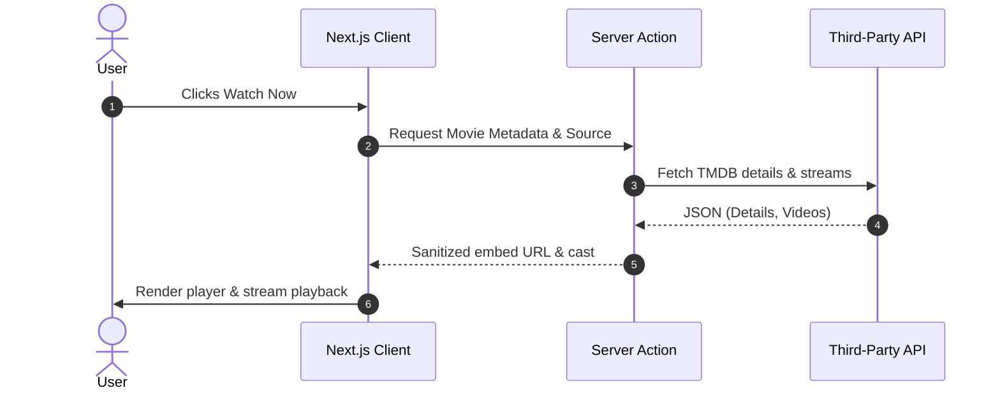
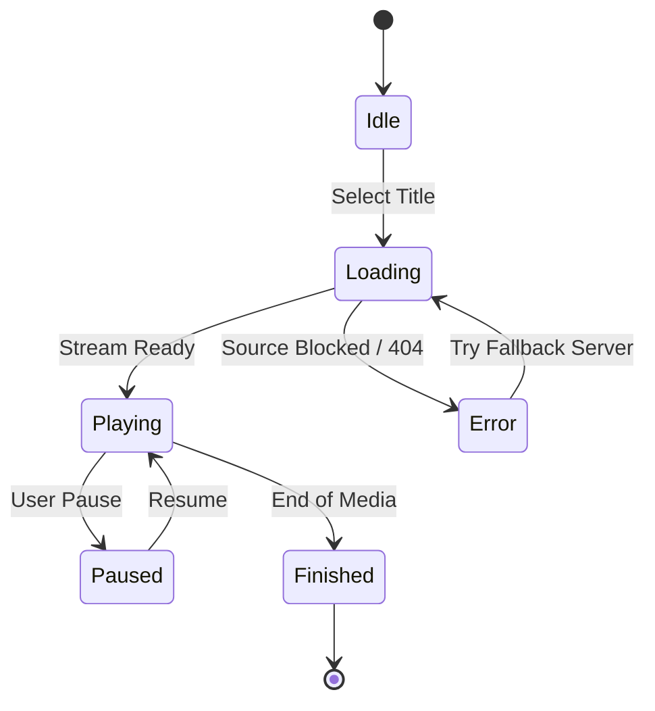

# Diagram Design & Visual Modeling Skill

This skill guides the design, construction, and embedding of technical diagrams in documentation, plans, and walkthroughs.

## When to Use
- Designing new features or modules before implementation.
- Explaining data pipelines, microservices, or API integrations.
- Documenting database schemas (Entity-Relationship models).
- Modeling asynchronous state transitions or user authentication flows.

## Core Principles
1. **Clarity Over Clutter**: Maximum 7-10 nodes per diagram. If more are needed, break into sub-diagrams.
2. **Standard Orientations**:
   - Left-to-Right (`flowchart LR`) for pipelines, data feeds, and timeline steps.
   - Top-to-Bottom (`flowchart TD`) for hierarchies, tier architectures, and decision trees.
3. **Escaping & Labels**:
   - Always quote labels containing special characters: `client["Client (Next.js)"]`.
   - Never use raw HTML tags inside node text.
4. **Style Consistency**:
   - Group related components with `subgraph`.
   - Use standardized accent colors for external services, databases, and client boundaries.

## Common Diagram Templates

### 1. Web Architecture (Frontend / API / Backend / Storage)

### 2. Sequence Diagram (Async Request / Auth Flow)

### 3. State Transition (Media Player Lifecycle)

